# InstanceHandNGP
hand nerf: 基于Nerf（神经辐射渲染） 增量手部三维数据集，产生各角度手部快照
>概括： 
1.希望构建数据集，在手部做出各种动作时，都采集一系列离散图像；采用 nerf 生成该固定造型下手的三维 模型，从该模型中渲染不同视角的手部图像，增量出多视角图像数据。 
2.产生的数据集中包括：该实景的nerf训练结果，手部点云数据（为了应对后续需求，当输入是非图像数据，如超声、lidar数据时的需求）。构建数据集的全流程可以有效的减少前期采集数据的难度，后续的增量和单个数据的构建自动化的程度高。 
3.此外，当采集多个视角的图像较为方便的情况下，方案中的通过nerf制造数据的过程可以全替换为现场采集真实数据。 
4.后续（不包括在这个工作中）：期望采集的用于训练“固定多视角手部图片作为输入的，手指关键点三维坐标作为输出 的网络”。该方案暂定4个固定视角输入图片，模拟四个固定的摄像头用于采集图像信息。--2021.11.13 

>这个文档是为了整理从 https://www.yuque.com/huangyuxiang-8hx5j/xyvz8w/hg3g7q 搬运过来的

### 1. 用于训练 nerf 的数据集构建
>采用简单的colmap分析相机位姿，nerf 训练场景的方式
实验中使用的都是huawei mate 30Pro 的主摄像头来采集图像，摄像头焦距自动计算，拍摄时等效35mm，（如果使用摄像模式，huawei 手机拍摄自动变焦，拍摄时需要注意，拍摄效果基本可以；此外，huawei手机摄像在手来回抖动拍摄时，和自动对焦总对到脸上去时由于colmap的匹配功能等原因对结果影响最大，需要注意）。使用colmap对连续拍摄的照片进行位姿自动分析，（如果非连续轨迹拍摄的离散位姿照片，注意colmap的分析模式选择）：
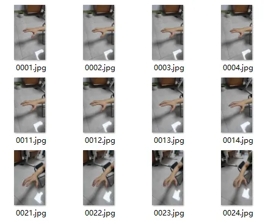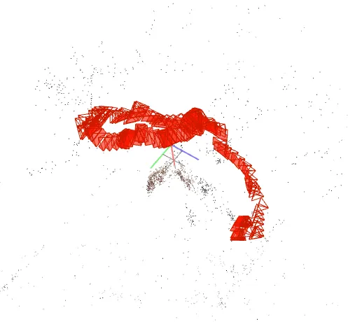
colmap输出的相机位姿（extrinsic matrix）以四元数和相机坐标来存储。注意intrinsic 的坐标系colmap文档中有介绍：The local camera coordinate system of an image is defined in a way that the X axis points to the right, the Y axis to the bottom, and the Z axis to the front as seen from the image.  

### 2. nerf训练
nerf训练工程基于https://github.com/NVlabs/tiny-cuda-nn 构建，坐标系统、psdf物理模型等设置篇幅不够这里简略。 
一般场景训练可以直接用 nerf 对采集图像训练。拍摄极近景的（如近距离拍摄手部数据）时候，可能需要将背景剔除，以保证训练效果。如果将该数据集训练数据的背景剔除，则需要注意训练nerf 的数据最好使用RGBA的图像格式。 剔除背景我使用的方式是直接分割图像中的手部作为前景，背景置为透明。由于没有搜索到现成的好用的人手部分割项目，于是自己用 ego2hand 数据集训练了一个（后续可能需要加入更多数据集进行效果提升）另外注意，在扣除背景的图像中要使用RGBA的数据结构保存，效果： 
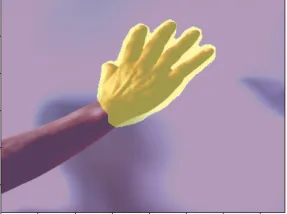
 "手部分割"   &&   "nerf空间中的连续轨迹渲染（连续轨迹是弱插值的）"
上例中的每一帧渲染图的相机 intrinsic 参数为焦距flx=fly=1217.4; 图像长宽w=1920,h=1080;有opencv形式的camera distortion，k1=-0.046；k2=0。camera distortion实验中忽略，由于我们所关心的手部基本都在观测点正中央，作为plane camera 处理。

### 3. 在制造出的数据中进行手部关键点找寻
>采用现成的2d手部关键点找寻和 自研的根据相机位姿计算的三维空间手部关键点定位接口，来共同实现
#### 3-1. 2d手部关键点定位
使用网络上的现成项目进行手部关键点定位。如 下右图，手部骨架和关键点位置示例：
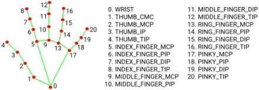 
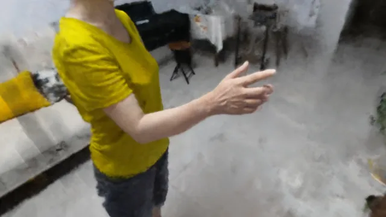
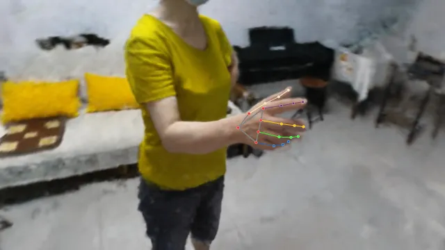

#### 3-2. 三维手部关键点定位
>● 人为指定的相机位姿，渲染出若干帧图像； 
● 人为筛选出若干帧图像，进行手部二维关键点定位。 
● 根据二维关键点的位置和该帧相机位姿计算扫描线。 
● 根据多帧扫描线的空间位置（相交或近点）确定手部 关键点的三维 位置。

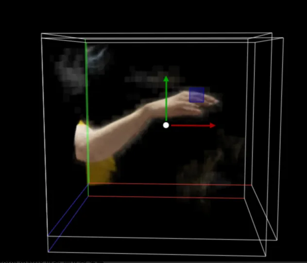 
以FINGER_TIPS 点为例：实验中，取20个点，即所选cube 上的8个顶角和12个边中点（这里选择的坐标系与nerf原文中保持一致，且不经过方向矫正使得主方向向上），计算他们的相机位点坐标及相机朝向原点时的 c2w 矩阵，进行渲染，并自动识别finger tips 等关键点，如下图为其中一帧： 
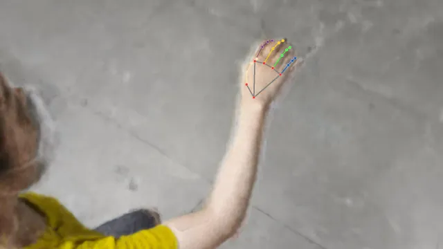 
根据多帧图像计算空间中手部的位点： 
由空间中直线  两两计算确切的 指尖位置： 
1.通过intrinsic matrix 计算出相机空间中的FINGER_TIPS 点的方向向量 a； 
2.根据extrinsic matrix 算出世界坐标系下的FINGER_TIPS 扫描线 a'; 
3.由于我们采集了多帧渲染图片，因此取出各帧中的扫描线两两计算：算出距离两扫描线最近的点（两线不相交时）或者两扫描线的交点（两线相交时） 
4.筛选准确的点：1）聚类算法获得交点的中心，并去除偏差较远的点 （一般不用，除非点数太多）； 2）根据筛选出的各交点代表的两条扫描线之间的平行程度（cross product）设定各交点的权重，加权平均获得 FINGER_TIPS 点的坐标； 
计算结果举例：图中线为穿过各帧图像中 FINGER_TIPS 点的射线，线的交点为三维空间中，FINGER_TIPS 点的坐标： 
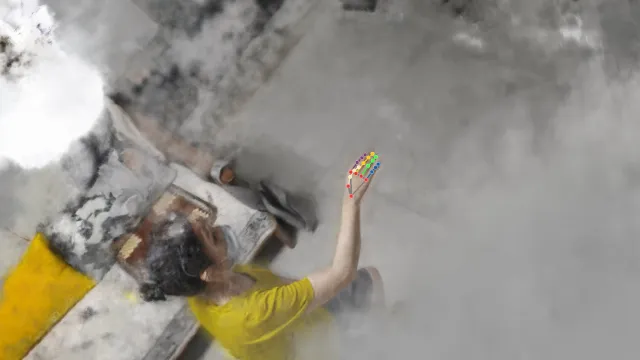
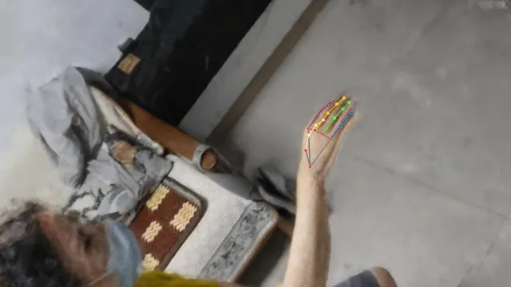
 
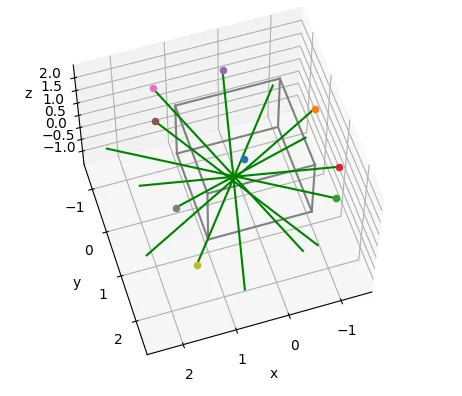 
以同样的方法获得食指上三点的三维坐标。

#### 3-3. 检查输出 点云坐标是否与 我们前面基于的坐标系相匹配
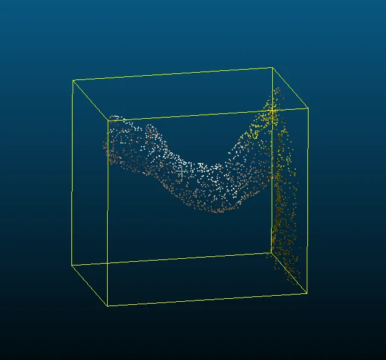
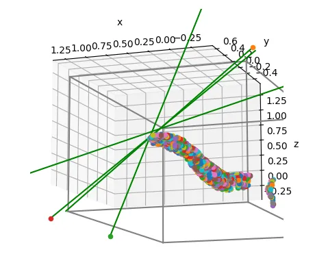 

#### 3-4. 手部数据增量
手部数据增量方式：旋转，平移； 
假设相机不动： 
对采集 渲染的 transform matrix 、手部各关键点位置（向量）、点云中各点坐标，进行操作：乘以相同的随机生成的旋转矩阵（模拟旋转），加上相同的位移 T（模拟平移）。这里加入的都是各项同性的变换。 
 
 
 
## 附录
### 手关键点定位网络训练

>讨论可行方案，并给出当前方案

[Neural Network Architect Discuss](doc/3DDetrNet.md)

### 镜像空间系统
待开发