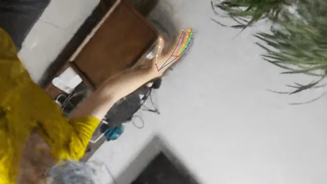

# InstanceHandNGP
hand nerf: 基于Nerf 增量手部三维数据集
>概括： 
1.希望构建数据集，在手部做出各种动作时，都采集一系列离散图像；采用 nerf 生成该固定造型下手的三维 模型，从该模型中渲染不同视角的手部图像，增量出多视角图像数据。 
2.产生的数据集中包括：该实景的nerf训练结果，手部点云数据（为了应对后续需求，当输入是非图像数据，如超声、lidar数据时的需求）。构建数据集的全流程可以有效的减少前期采集数据的难度，后续的增量和单个数据的构建自动化的程度高。 
3.此外，当采集多个视角的图像较为方便的情况下，方案中的通过nerf制造数据的过程可以全替换为现场采集真实数据。 
4.后续（不包括在这个工作中）：期望采集的用于训练“固定多视角手部图片作为输入的，手指关键点三维坐标作为输出 的网络”。该方案暂定4个固定视角输入图片，模拟四个固定的摄像头用于采集图像信息。--2021.11.13

### 1. 用于训练 nerf 的数据集构建
>采用简单的colmap分析相机位姿，nerf 训练场景的方式
实验中使用的都是huawei mate 30Pro 的主摄像头来采集图像，摄像头焦距自动计算，拍摄时等效35mm，（如果使用摄像模式，huawei 手机拍摄自动变焦，拍摄时需要注意，拍摄效果基本可以；此外，huawei手机摄像在手来回抖动拍摄时，和自动对焦总对到脸上去时由于colmap的匹配功能等原因对结果影响最大，需要注意）。使用colmap对连续拍摄的照片进行位姿自动分析，（如果非连续轨迹拍摄的离散位姿照片，注意colmap的分析模式选择）：

colmap输出的相机位姿（extrinsic matrix）以四元数和相机坐标来存储。注意intrinsic 的坐标系colmap文档中有介绍：The local camera coordinate system of an image is defined in a way that the X axis points to the right, the Y axis to the bottom, and the Z axis to the front as seen from the image.  

### 2. nerf训练
一般场景训练可以直接用 nerf 对采集图像训练。拍摄极近景的（如近距离拍摄手部数据）时候，可能需要将背景剔除，以保证训练效果。如果将该数据集训练数据的背景剔除，则需要注意训练nerf 的数据最好使用RGBA的图像格式。 剔除背景我使用的方式是直接分割图像中的手部作为前景，背景置为透明。由于没有搜索到现成的好用的人手部分割项目，于是自己用 ego2hand 数据集训练了一个（后续可能需要加入更多数据集进行效果提升）另外注意，在扣除背景的图像中要使用RGBA的数据结构保存，效果： 

 "手部分割"   &&   "nerf空间中的连续轨迹渲染（连续轨迹是弱插值的）"
上例中的每一帧渲染图的相机 intrinsic 参数为焦距flx=fly=1217.4; 图像长宽w=1920,h=1080;有opencv形式的camera distortion，k1=-0.046；k2=0。camera distortion实验中忽略，由于我们所关心的手部基本都在观测点正中央，作为plane camera 处理。

### 3. 在制造出的数据中进行手部关键点找寻
>采用现成的2d手部关键点找寻和 自研的根据相机位姿计算的三维空间手部关键点定位接口，来共同实现
#### 3-1. 2d手部关键点定位
使用网络上的现成项目进行手部关键点定位。如 下右图，手部骨架和关键点位置示例：
 

#### 3-2. 三维手部关键点定位
>● 人为指定的相机位姿，渲染出若干帧图像； 
● 人为筛选出若干帧图像，进行手部二维关键点定位。 
● 根据二维关键点的位置和该帧相机位姿计算扫描线。 
>● 根据多帧扫描线的空间位置（相交或近点）确定手部 关键点的三维 位>置。

 
以FINGER_TIPS 点为例：实验中，取20个点，即所选cube 上的8个顶角和12个边中点（这里选择的坐标系与nerf原文中保持一致，且不经过方向矫正使得主方向向上），计算他们的相机位点坐标及相机朝向原点时的 c2w 矩阵，进行渲染，并自动识别finger tips 等关键点，如下图为其中一帧： 
 
根据多帧图像计算空间中手部的位点： 
由空间中直线  两两计算确切的 指尖位置： 
1.通过intrinsic matrix 计算出相机空间中的FINGER_TIPS 点的方向向量 a； 
2.根据extrinsic matrix 算出世界坐标系下的FINGER_TIPS 扫描线 a'; 
3.由于我们采集了多帧渲染图片，因此取出各帧中的扫描线两两计算：算出距离两扫描线最近的点（两线不相交时）或者两扫描线的交点（两线相交时） 
4.筛选准确的点：1）聚类算法获得交点的中心，并去除偏差较远的点 （一般不用，除非点数太多）； 2）根据筛选出的各交点代表的两条扫描线之间的平行程度（cross product）设定各交点的权重，加权平均获得 FINGER_TIPS 点的坐标； 
计算结果举例：图中线为穿过各帧图像中 FINGER_TIPS 点的射线，线的交点为三维空间中，FINGER_TIPS 点的坐标： 

 
 
以同样的方法获得食指上三点的三维坐标。

#### 3-3. 检查输出 点云坐标是否与 我们前面基于的坐标系相匹配

 

#### 3-4. 手部数据增量
手部数据增量方式：旋转，平移； 
假设相机不动： 
对采集 渲染的 transform matrix 、手部各关键点位置（向量）、点云中各点坐标，进行操作：乘以相同的随机生成的旋转矩阵（模拟旋转），加上相同的位移 T（模拟平移）。这里加入的都是各项同性的变换。 
 
 
 
## 附录
### 手关键点定位网络训练

>讨论可行方案，并给出当前方案

#### 场景描述
假设我们使用的显示器四个角中的三个各有一个摄像头，希望根据不同视角的摄像头定位到屏幕前的（60cm*50cm*40cm ）三维空间中较为精确的手指关键点位置。 
理论上传统算法中：两个摄像头可以通过景深计算获得一些有用信息，甚至直接计算指尖的位置，但是这里尝试的目的在于：1）得到更加精确的位置；2）为后续修改算法提供一些基础和空间，方便尝试传统算法所不具备的能力，例如结合时间维度，通过时间序列的输入等操作分析运动轨迹获得更加可靠的插值轨迹等。 

#### 参考方案
1.参考 bevformer 使用spatial cross attention： 
 
图2.1.1：引用自 bevformer 的原文（后续补全） 
这个方案与当前任务比较不合的 一点：智能驾驶中关注的重要输出是二维的BEV map，因此在z方向（纵向）上 的采样只踩数量不多的点构成跟空间位置高度相关的 BEV map。BEV feature map 在H和W方向分辨率可控。 
 
2.更加有参考价值的是 deformable DETR： 
与DETR不同， deformable DETR 将对backbone（即简单卷积产生的图像特征）的采样精简，使得不需要对全局做自注意力。 
这里插个题外话，做个假设：如果要寻这DETR 或者 BEV former 的思路，来实现我们此处的任务。由于必须构建三维空间中的相应位置的特征序列（这肯定是3维的），那么对于三维空间中的每个点都反向投影寻找二维坐标中的相应位置的权重。这将带来较大的计算代价。  与此相对：deformable detr则只采集极少的点。（而 deformable detr 的灵感来自可变形卷积） 
 
图2.1.2：引自 deformable detr 原文（后续补全引用与解读相关结构） 
参考这个方案，我们虽然是要利用三维向量空间中的具体位置 以及相机的 extrinsic、intrinsic 来采集我们需要预测的目标位置处的图像特征，但是只要做一个 sparse 采集就行，将相应的状态和采集点信息保存在 Query Feature $Z_q$中，用作计算采集图像信息的reference point 。此外，其实该方法中作为先验信息的refrence point 可以利用前面提到的相机参数，由三维空间到相机图像投影获得，因此应该能确保收敛和收敛速度。 
此外，deformable detr 还能通过叠加使用 decoder 来一层层修正reference point 使其得到更加准确的定位结果，该设计模仿了光流法的迭代获取更加准确的光流场的过程（这一点对于自己写CUDA加速训练过程很重要）。这个性质契合我们的需求，即找到更加准确的3D位置。 

#### 采用的结构
采用backbone 加 transformer decoder 解码的总体结构，在多层 transformer 的每一层都会渐进的输出回归的坐标以供 loss 回传。backbone 选择 Resnet + FPN(目前尝试不加)。transformer 的结构如下（发现一篇基于detr 的三维目标检测 https://arxiv.org/abs/2110.06922，借鉴其结构调整如下）： 
 
方案中，假设手上的每一个关键点都由一个query代表。
1.图中左边是resnet加fpn的backbone提取的多分辨率层级的feature map； 
2.中间 3D reference point 是由右边的transformer decder 求出的； 
3.借鉴 bev former 和 deformable detr，3D reference point 根据各个camera的 extrinsice 以及 intrinsic 矩阵得到相应点在各个camera 的 feature map 中的相应位置，这些位置不一定正好落到整数pixel上（尤其低分辨率的feature level），因此由双线性插值得到； 
4.从上一步得到的插值的feature，concate 得到 query； 
5.query进入transformer；transformer 由 self attention ，norm ， cross attention， norm, MLP, norm 。其中 self attention 就是 nn.MultiHeadAttentionl。而cross attention 借鉴了 https://arxiv.org/abs/2110.06922 的重要结构： 
其中包括上图中编号 1 所代表的由 3D reference point 取得相应位置的 feature map 的操作。由 reference point 采集得到的feature 与由原query 经过linear 层（为了使向量维度与feature一致）得到的embedded向量做cross attention。 cross attention 的输出经过linear 输出 transformer得到的是新 query； 
6.以上5中得到的query有残差结构，并且要加上position encoding：输出=原始输入+双线性插值特征+query位置特征。且由新query 再预测一个reference point 作为下一个transformer的输入。(详细的代码可以参考原文，或后续会整理上传github)。 
7.注意：与原作不同，新预测的 refined reference point 对于下一层是不进入loss 回传的，当作先验，用pytorch 的detach处理；但每一层transformer的输出 reference point 都会与ground truth（各个手部关键点） 计算loss，对本层的权重进行回传（作用是逐层矫正 该point），可以用克隆的tensor detach() 之后输出下一层，但是本层还是用未detach 的进行回传计算。 

另外在尝试的还有一种参考 deformable detr 的结构，该结构在附加段https://www.yuque.com/huangyuxiang-8hx5j/xyvz8w/hg3g7q#yjxY2中给出。 

#### 关于Loss
需要一个点做为reference point 来支持其他点的找寻，而不是每一个点在每一时刻都是可见的，当握拳时指尖就不可见，因此，我们需要额外定义一个判断函数来计算可见或不可见，即纳不纳入Loss。
（仅考虑当前时刻的预测与训练，则不可见的点可以需要也可以不需要loss，当考虑手结构信息时就需要加入Loss计算。如果有时序输入，就应考虑加入不可见的点的计算）。
这个工作的第一阶段目标是建立：从指尖到屏幕上的像素的指向、投射关系（允许一定误差范围，该误差范围由屏幕上目标大小来动态决定，且因为显示屏信号传递模型也符合“香农采样定理”，因此精度不会高于屏幕分辨率），之后应当加入以屏幕像素间距离为loss的端到端训练。

#### 附加讨论
##### 网络结构
另一种早先尝试的相似的网络结构。目前transformer层的cross attention层可能有待改进，几个点的偏移量之间的计算，以及得到各个关键点的部分有待完善。目前看来，各个关键点虽然是随同一个query进入 transformer 层的，预测的也是相对于reference point的偏移量，但是这与直接预测多个query散点本质上无异，没有很好的模仿deformable detr 中“类似可变形卷积”的采集feature方式，或者说没有比前面讨论的方法更加强调单只手上各个关键点之间的相关关系： 
 

##### 关于Loss
之后工作，与改进：
本次简单训练仅假设图中有一只手，所以并未采用set-to-set的训练方式，有未使用hungariann loss或NMS。这也是后续需要改进的。
后续需要验证如果训练数据中有很多手的时候，同一只手的各个关键是否会混乱或者丢点，以及是否需要进行改变网络结构为：用单个 reference point 预测bounding box 以及各个reference point 的坐标。

### 镜像空间系统
待开发